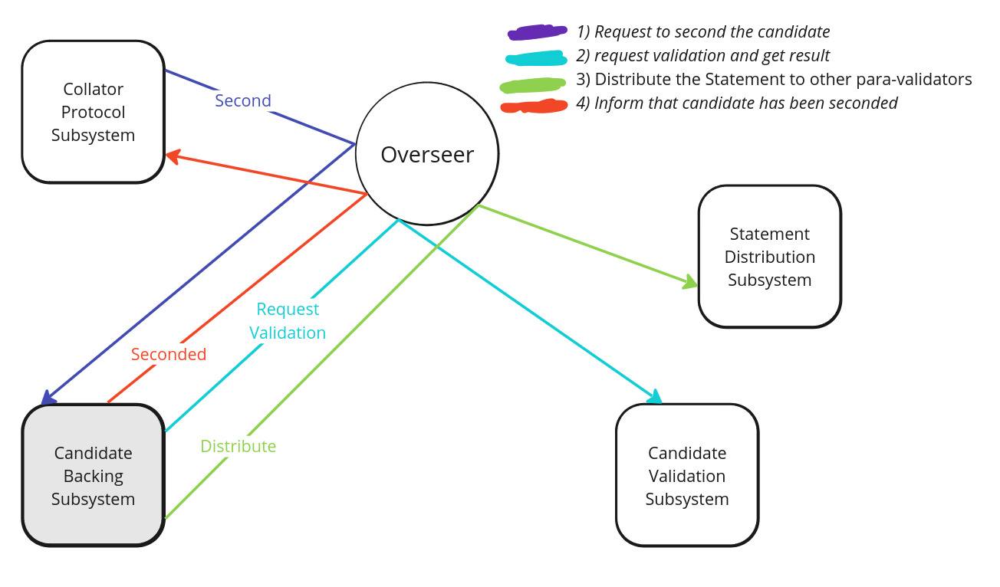

Before diving into the Candidate Backing Subsystem of the Polkadot Parachain Protocol, it's important to first understand the basics: what the Parachain Protocol is, who collators are, and the role of validators.

### Parachain propocol
The Parachain Protocol is designed to take a parachain's block from creation to being included on the Relay Chain. This process can happen simultaneously for all parachains linked to the Relay Chain, allowing the network to be divided efficiently among parachains while still ensuring high security.

### Collators
TODO: who can be collator? <br />
Collators generate a Proof-of-Validity(PoV) that validators can verify. To create this PoV, collators need to understand the transaction format and block creation rules of a specific parachain and have access to its full state.

### Validators
TODO: who can be Validator? <br />
Validators are tasked with verifying proposed parachain blocks by checking their Proof-of-Validity (PoV) and ensuring the PoV is available for a set period. They have funds locked on-chain, which can be partially or fully taken by the network if they act improperly.

Some validators are assigned to specific parachains by the Validator Assignment Routine and are known as para-validators. They connect with collators, who submit candidate blocks along with Proof-of-Validity (PoV) through the Collator Subsystem.

Para-validators take part in the Candidate Backing Subsystem. Their role is to verify that a candidate block adheres to the parachain’s state transition rules. Since states are stored in Merkle trees, para-validators can check state transitions without needing the entire state, but they do require a specific set of information called Proof-of-Validity.


# Candidate backing subsystem

### What is candidate?
* parachain block is a candidate to be added in relaychain block so we call it a candidate block. 

### What are the validity statements that parachain validators can issue?
* Parachain validators can issue two types of statements for a candidate block:
    * **Seconded**: This statement means the validator has verified the candidate block and is proposing it to other parachain validators for further validation.
    * **Valid**: This statement indicates that the candidate block is valid.

* A Seconded statement automatically implies that the block is Valid, so a block should not be marked as Valid unless it has already been seconded. Only parachain validators can second candidate blocks, and they are limited to seconding one candidate per depth per active leaf. Before asynchronous backing, the depth is always 0.

### Backable Candidate vs. Backed Candidate
* A candidate block becomes **backable** when it receives enough supporting statements from the parachain validators. Under the legacy backing system (before asynchronous support), a candidate required two supporting votes to be considered backable.
* Once a backable candidate is recorded in a relay-chain block, it becomes a **backed candidate**.

### Overview

* The Candidate Backing Subsystem ensures that each parablock proposed for inclusion in the relay chain meets strict validation requirements. Specifically, a parablock must be seconded by at least one parachain validator and approved by a quorum of validators.
* Parablocks that don't gather enough validator votes confirming their correctness are rejected. If a candidate block that was initially validated is later found to be invalid, the validators who voted for it may face slashing penalties.

* The Candidate Backing Subsystem is responsible for producing backable candidates for inclusion in new relay-chain blocks. It accomplishes this by:
    * Issuing signed statements.
    * Tracking statements received from other validators.
    * Combining these statements into backing for specific candidates once enough support is obtained.

* This subsystem does not determine which candidate is ultimately included in the relay chain; that decision is left to the block author. However, once a sufficient quorum of validators agrees on a candidate’s validity, the subsystem notifies the [Provisioner](https://paritytech.github.io/polkadot-sdk/book/node/utility/provisioner.html), who then triggers the block production mechanisms to include the parablock in the relay-chain block.

**NOTE:** We have used the term "candidate block" for simplicity, but in implementation, it is referred to as a [candidate-receipt](https://wiki.polkadot.network/docs/learn-parachains-protocol#candidate-receipts) 


## candidate backing message
### Second
The `SecondMessage` is sent by the Collator Protocol Subsystem to the Candidate Backing Subsystem to validate a candidate block and proposes it to other validators for further validation.

```
type SecondMessage struct {
	RelayParent             common.Hash
	CandidateReceipt        parachaintypes.CandidateReceipt
	PersistedValidationData parachaintypes.PersistedValidationData
	PoV                     parachaintypes.PoV
}
```



**Functionality:**
The Candidate Backing Subsystem requests validation from the Validation Subsystem and generates the appropriate statement based on the validation result.

If the Candidate is Invalid:
* If the candidate was recommended by the validator's own Collator Protocol Subsystem, a message is sent back to the Collator Protocol Subsystem with the candidate's hash. This allows the collator that recommended the invalid candidate to be penalized.

If the Candidate is Valid:
* The subsystem signs and dispatches a Seconded statement to peers, but only if the validator has not already seconded another candidate or signed a Valid statement for the requested candidate.
* The issued statement is stored in the validator's statement table.
* Signing both a Seconded and Valid statement for the same candidate is considered double-voting, which is a misbehavior with a severe penalty.


### Statement
The `StatementMessage` represents a validator's assessment of a specific candidate received from other parachain validators and is sent by the Statement Distribution Subsystem to the Candidate Backing Subsystem.

```
type StatementMessage struct {
	RelayParent         common.Hash
	SignedFullStatement parachaintypes.SignedFullStatementWithPVD
}
```


**Functionality:**
- If the statement in the message is `Valid`, it will be stored in statement table of current parachain validator.
- If the statement in the message is `Seconded` and it contains a candidate that belongs to our assignment, request the corresponding `PoV` from the backing node via `AvailabilityDistribution`.
    - backing nodes are the nodes who have issued the statement for a candidate. 
- after getting `POV`, launch validation and Issue our own Valid or Invalid statement as a result. and store the statement in statement table.
- If there are disagreements regarding the validity of this assessment, they should be addressed through the Disputes Subsystem
- Meanwhile, agreements are straightforwardly count to the quorum.


### GetBackableCandidates
The `GetBackableCandidatesMessage` is a request sent by the Provisioner Subsystem (Utility Subsystem) to the Candidate Backing Subsystem to retrieve a set of backable candidates that could be backed in a child of the given relay-parent.

```
type GetBackableCandidatesMessage struct {
	Candidates []*CandidateHashAndRelayParent
	ResCh      chan []*parachaintypes.BackedCandidate
}
```

**Functionality:**
* The Candidate Backing Subsystem identifies candidates from the provided list that have received enough supporting statements from parachain validators and returns these backable candidates through the response channel.
* In the legacy backing system (before asynchronous support), a minimum of 2 supporting statements are required.